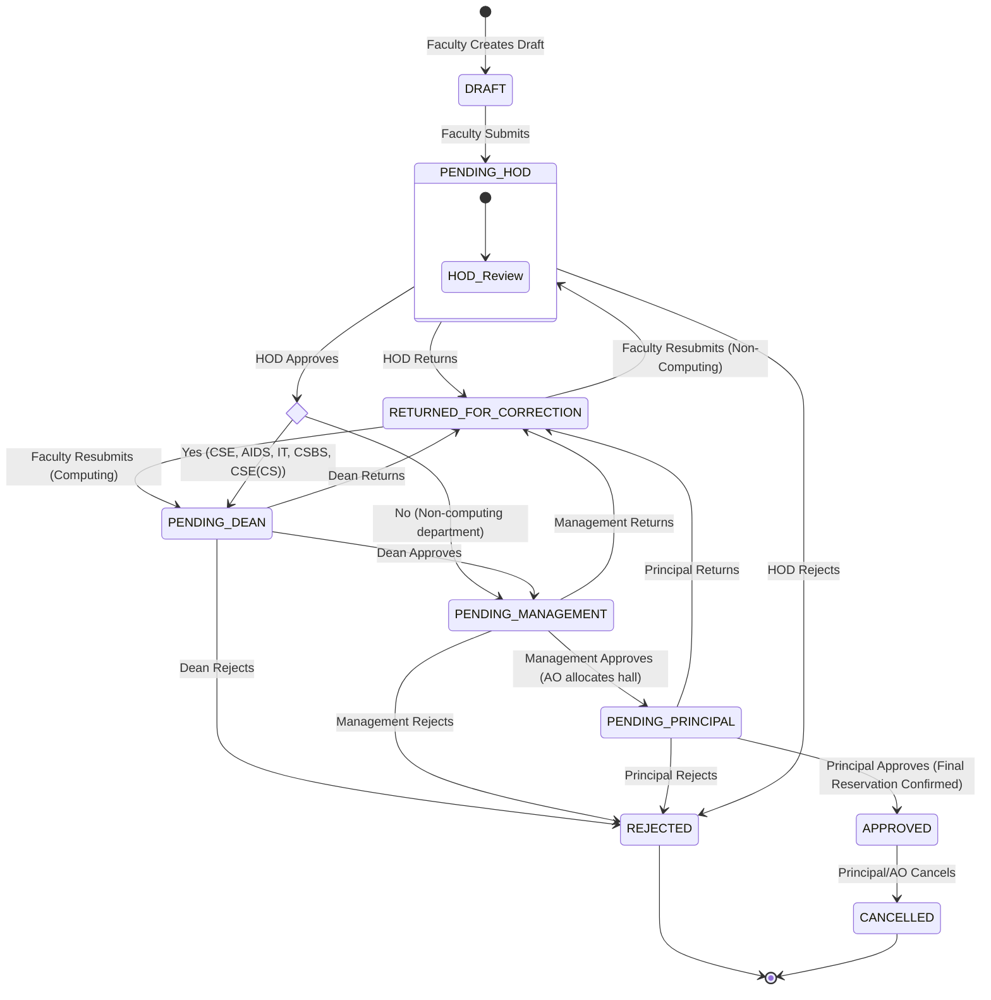

# System Documentation: Dr. NGPIT Function Requirement System

Welcome to the official developer and system administrator documentation for the **Dr. NGPIT Function Requirement System**. This document details the system design, modular architecture, database schemas, role permission policies, workflow state machine transitions, and API specifications.

---

## Table of Contents
1. [System Overview & Purpose](#1-system-overview--purpose)
2. [Architecture & Directory Structure](#2-architecture--directory-structure)
3. [Workflow State Machine & Transitions](#3-workflow-state-machine--transitions)
4. [Responsibility-Based Editing Policy](#4-responsibility-based-editing-policy)
5. [Audit Trail & Timeline Logging](#5-audit-trail--timeline-logging)
6. [Database Schema & Models](#6-database-schema--models)
7. [Venue Booking & Double-Booking Prevention](#7-venue-booking--double-booking-prevention)
8. [API Endpoints Directory](#8-api-endpoints-directory)
9. [Local Development Setup & Commands](#9-local-development-setup--commands)

---

## 1. System Overview & Purpose

The **Dr. NGPIT Function Requirement System** is a workflow automation portal designed to manage academic function requests, guest invitations, and resource allocations (such as seminar halls, refreshments, lodging, transport, and equipment) within the college. 

It replaces manual paper routing with a digital approval hierarchy. The system provides:
- **Role-based dashboard views** for Faculty, Department Heads (HODs), Deans, Management (Administrative Officers), and the Principal.
- **Strict responsibility boundaries** restricting users to modifying only fields within their domain.
- **Double-booking checks** preventing overlapping venue reservations.
- **A detailed audit trail** logging all transitions, modification history, and remarks on an interactive timeline.

---

## 2. Architecture & Directory Structure

The system is built as a decoupled **Single Page Application (SPA)** utilizing a React frontend and a Django REST Framework (DRF) backend.

```
function/
├── backend/                             # Django REST API Backend
│   ├── accounts/                        # User profiles & role definitions
│   ├── approvals/                       # Approval logs & audit trail
│   ├── departments/                     # College department listings
│   ├── halls/                           # Seminar halls & capacities
│   ├── requests/                        # Core request models, serializers, & views
│   ├── resources/                       # One-to-one resource requirement schemas
│   ├── function_requirement_system/     # Settings, root URLs, and WSGI entry
│   └── manage.py
├── frontend/                            # React (Vite) Frontend
│   ├── src/
│   │   ├── components/                  # Reusable widgets (StatusBadge, Timeline, Stepper)
│   │   ├── pages/                       # Page templates (Dashboard, ViewRequest, EditRequest)
│   │   ├── App.jsx                      # Client router mappings
│   │   └── main.jsx                     # Entry point
│   ├── index.html
│   └── vite.config.js
└── SYSTEM_DOCUMENTATION.md              # This file
```

### Key Technical Stack details:
- **Frontend**: React 18, Vite (for asset pipeline and hot module reloading), Axios (API client), and SimpleJWT stored in `localStorage` for authentication. Styling uses clean CSS variables for cohesive styling.
- **Backend**: Django 5.x, Django REST Framework, Django CORS Headers, and simplejwt for token authentication. SQLite is configured for local development.

---

## 3. Workflow State Machine & Transitions

Every function request moves through a sequential pipeline from initial creation to final reservation confirmation.



### Stored Correction Loop
When a reviewer returns a request for correction:
1. The backend stores the request's current state in the `previous_status` field.
2. The request status is set to `RETURNED_FOR_CORRECTION`.
3. After the Faculty edits and clicks **Resubmit**, the status is automatically restored to `previous_status` (or defaults to `PENDING_HOD`), resuming the approval loop from the stage where it was returned.

---

## 4. Responsibility-Based Editing Policy

To align with institutional boundaries, editing is permitted only under strict role-responsibility scopes. If a user modifies blocked fields, the backend raises a `403 Forbidden` error.

| Role | Permitted Editing Scope | Prohibited Fields / Blocked Modifications | Active Editing State |
| :--- | :--- | :--- | :--- |
| **Faculty** | **All fields**: Academic title, schedule, guest details, and all logistics parameters. | Blocked from editing once submitted. | `DRAFT`, `RETURNED_FOR_CORRECTION` |
| **HOD** | **Academic & Scheduling Details**: Function title, type, dates, times, training category, student count, class name, guest details. | **Logistics & Allocations**: Cannot modify `venue` selection, guest rooms, meals, transport, or AV equipment. | `PENDING_HOD` |
| **Dean** | **Technical Event Scopes**: Function name, type, and training category. | **Schedules & Logistics**: Cannot modify dates, times, student counts, guest details, transport, refreshments, or halls. | `PENDING_DEAN` |
| **Management (AO)** | **Logistics & Resources**: Seminar Hall (`venue`), guest house rooms, tiffin/lunch counts, A/C, projector, photographer, transport. | **Academic Context**: Cannot edit function name, dates, times, student classes, guest names, or designations. | `PENDING_MANAGEMENT` |
| **Principal** | **Read-Only**: Approves or rejects only. | **All Fields**: Cannot edit any request details directly. Must return to Management or Faculty for changes. | None (Read-only at all times) |

### Backend Enforcement Mechanism
Responsibility constraints are validated in `backend/requests/api_views.py` through the `check_unauthorized_edits` helper. The validator normalizes values (mapping `None`, `"None"`, and `""` to an empty string) and compares incoming payloads against database values:

```python
# Extract of checks inside check_unauthorized_edits
if user_role == 'HOD':
    if normalize(existing_venue) != normalize(incoming_venue):
        changed_blocked_fields.append('venue')
    # Loop over logistics models (refreshment, transport, guest_house, etc.)
    ...
```

---

## 5. Audit Trail & Timeline Logging

All workflow actions and administrative edits are saved to prevent modification gaps. The `ApprovalLog` model stores history entries:

```python
class ApprovalLog(models.Model):
    function_request = models.ForeignKey(FunctionRequest, on_delete=models.CASCADE, related_name='approval_logs')
    approver = models.ForeignKey(User, on_delete=models.SET_NULL, null=True)
    stage = models.CharField(max_length=30)  # e.g., 'HOD', 'MANAGEMENT'
    status = models.CharField(max_length=30)  # e.g., 'APPROVED', 'MODIFIED', 'RETURNED_FOR_CORRECTION'
    remarks = models.TextField(blank=True)
    timestamp = models.DateTimeField(auto_now_add=True)
```

### Administrative Modification Logs
When HOD, Dean, or Management modifies fields within their scope, the backend calculates the differences and logs a `MODIFIED` transition:
- **Remarks Field**: Automatically populated with a detailed diff, e.g.:
  `"Modified: Venue (from 'None' to 'Conference Hall A'), Refreshments (from '0 Veg' to '10 Veg'). Remarks: Assigned based on student registration count."`
- The vertical timeline component on the frontend displays these logs chronologically.

---

## 6. Database Schema & Models

Below is the entity schema and model structure:

```
┌──────────────────┐          ┌──────────────────────┐
│  FacultyProfile  │ 1 ─── 1:N │   FunctionRequest    │
└──────────────────┘          └──────────────────────┘
                                         │ 1
                                         ├───── 1:1 ───► GuestHouseRequirement
                                         ├───── 1:1 ───► RefreshmentRequirement
                                         ├───── 1:1 ───► PowerCameraRequirement
                                         ├───── 1:1 ───► MementoRequirement
                                         └───── 1:1 ───► TransportRequirement
```

### Core Request Table
- `faculty` (ForeignKey to `FacultyProfile`): Identifies the requesting Faculty member.
- `department` (ForeignKey to `Department`): Identifies the department holding the event.
- `status`: String field holding the active lifecycle state.
- `previous_status`: Nullable string to manage correction restoration.
- `venue` (ForeignKey to `SeminarHall`): The hall selected for the event.

### Nested Logistics Models (One-to-One relationships in `resources/models.py`)
1. **GuestHouseRequirement**:
   - `required` (Boolean)
   - `number_of_persons` (Integer)
   - `room_type` (String)
   - `from_date`, `to_date` (Date)
2. **RefreshmentRequirement**:
   - `tea_required`, `coffee_required`, `snacks_required` (Boolean)
   - `required_time` (Time)
   - `tiffin_count`, `normal_lunch_count`, `veg_lunch_count`, `non_veg_lunch_count` (Integer)
   - `payment_through` (String Choice: `ASSOCIATION` or `INSTITUTION`)
3. **PowerCameraRequirement**:
   - `mic_required`, `ac_required`, `projector_required`, `laptop_required` (Boolean)
   - `photographer_required` (Boolean)
   - `photographer_type` (String Choice: `LAB_TECHNICIAN` or `OFFICIAL`)
4. **MementoRequirement**:
   - `required` (Boolean)
   - `honorarium_worth` (String)
   - `quantity` (Integer)
   - `dias_seats`, `audience_seats`, `table_cloths` (Integer)
   - `reception_items` (Text description of flowers, shawls, nameplates, etc.)
5. **TransportRequirement**:
   - `required` (Boolean)
   - `date`, `pickup_time`, `pickup_location` (Date, Time, String)
   - `drop_date`, `drop_time`, `drop_location` (Date, Time, String)
   - `pickup_person_name`, `pickup_person_contact` (String)

---

## 7. Venue Booking & Double-Booking Prevention

A seminar hall booking is flagged as **Provisional** when Management (AO) assigns the venue and approves the request (transitioning it to `PENDING_PRINCIPAL`). It is flagged as **Confirmed** only after the Principal gives final approval (transitioning it to `APPROVED`).

### Overlap Verification Logic
When Management approves or when the Principal grants final confirmation, the backend checks for overlapping timeslots in the database:
```python
# Validation query in backend/requests/utils.py
overlapping_requests = FunctionRequest.objects.filter(
    status='APPROVED',
    venue=venue,
    start_date__lte=end_date,
    end_date__gte=start_date,
    time_from__lt=time_to,
    time_to__gt=time_from
).exclude(id=request_id)
```
If an overlap is detected, the approval fails and returns an `HTTP 400 Bad Request` block. If the request is rejected or cancelled, the provisional venue slot is released.

---

## 8. API Endpoints Directory

All private endpoints require Bearer JWT authentication headers.

| Method | Endpoint Path | Access Scope | Description |
| :--- | :--- | :--- | :--- |
| **POST** | `/api/v1/auth/login/` | Anonymous | Authenticates credentials and returns access and refresh JWT tokens. |
| **POST** | `/api/v1/auth/token/refresh/` | Anonymous | Refreshes expired access tokens. |
| **GET** | `/api/v1/requests/` | Authenticated | Lists requests. Faculty see only their own requests. HODs see departmental requests. AO/Principal see all requests. |
| **POST** | `/api/v1/requests/` | Faculty / Admin | Creates a new request (draft or submitted status). |
| **PUT** | `/api/v1/requests/{id}/` | Assigned User / Admin | Modifies an existing request. Edits are constrained by responsibility rules. |
| **POST** | `/api/v1/requests/{id}/approve/` | Approvers | Moves request to the next stage. Management must allocate a hall before approving. |
| **POST** | `/api/v1/requests/{id}/reject/` | Approvers | Rejects the request, stopping the workflow and releasing any venue holds. |
| **POST** | `/api/v1/requests/{id}/return_for_correction/` | Approvers | Saves current state to `previous_status` and routes request to `RETURNED_FOR_CORRECTION`. |
| **POST** | `/api/v1/requests/{id}/cancel_request/` | AO / Principal | Force cancels an approved request and releases the venue. |
| **GET** | `/api/v1/requests/queue/` | Approvers | Retrieves the review queue for the logged-in user. |
| **GET** | `/api/v1/halls/` | Authenticated | Lists all seminar halls and their seating capacities. |

---

## 9. Local Development Setup & Commands

Follow these steps to run the application in a local development environment.

### Backend Setup
1. Open a terminal and navigate to the project directory:
   ```bash
   cd d:\Coding\Projects\Personal\function
   ```
2. Activate the virtual environment and install dependencies:
   ```bash
   .\venv\Scripts\activate
   # dependencies are managed via pip or poetry
   pip install -r backend/requirements.txt
   ```
3. Run database migrations and seed default credentials:
   ```bash
   python backend/manage.py migrate
   python backend/manage.py seed_data
   ```
4. Start the Django REST development server (port `8000`):
   ```bash
   python backend/manage.py runserver 8000
   ```

### Frontend Setup
1. Open a second terminal and navigate to the `frontend` folder:
   ```bash
   cd d:\Coding\Projects\Personal\function\frontend
   ```
2. Install npm dependencies:
   ```bash
   npm install
   ```
3. Start the Vite development server (port `5173`):
   ```bash
   npm run dev
   ```

### Running Backend Tests
To verify validation logic, double-booking calculations, and permission boundaries, run:
```bash
python backend/manage.py test requests
```
